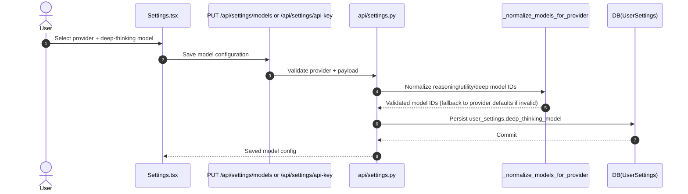
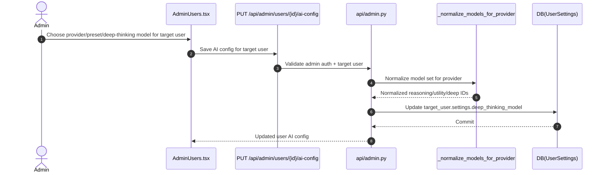
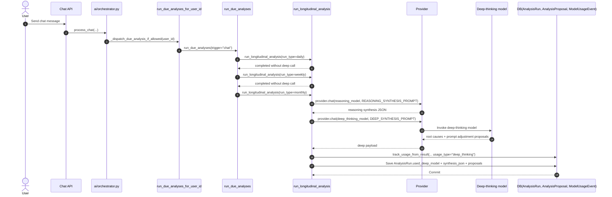
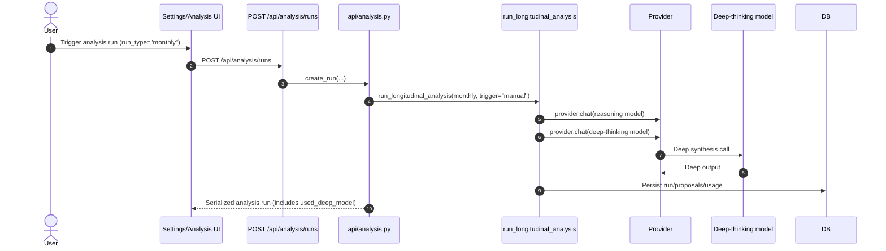
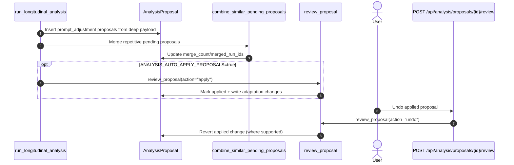
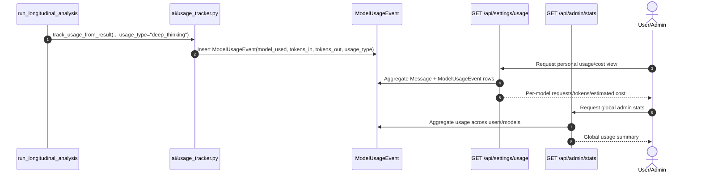
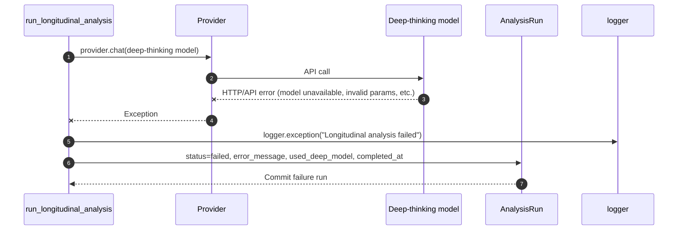

# Deep-Thinking Model - Sequence Flows

This document captures all current application interactions that configure, invoke, persist, and surface deep-thinking model work.

## 1) User Configures Deep-Thinking Model (Settings)

## 2) Admin Configures Deep-Thinking Model for a User

## 3) Chat-Triggered Due Analysis -> Monthly Deep Synthesis

## 4) Manual Monthly Analysis Run -> Deep Synthesis

## 5) Deep Proposal Lifecycle (Store -> Apply -> Undo)

## 6) Deep Usage Visibility (Cost/Token Reporting)

## 7) Failure Path for Deep-Thinking Calls

## Code Anchors

- Orchestrator dispatch: `backend/ai/orchestrator.py`
- Due-run scheduling and deep invocation: `backend/services/analysis_service.py`
- Provider deep model fallback: `backend/ai/providers/base.py`
- Provider model safety/normalization: `backend/ai/providers/__init__.py`
- User model config APIs: `backend/api/settings.py`
- Admin user model config API: `backend/api/admin.py`
- Analysis run/proposal APIs: `backend/api/analysis.py`
- Usage tracking and reporting: `backend/ai/usage_tracker.py`, `backend/api/settings.py`, `backend/api/admin.py`
