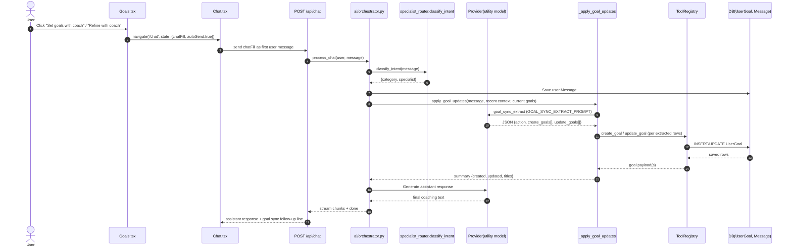
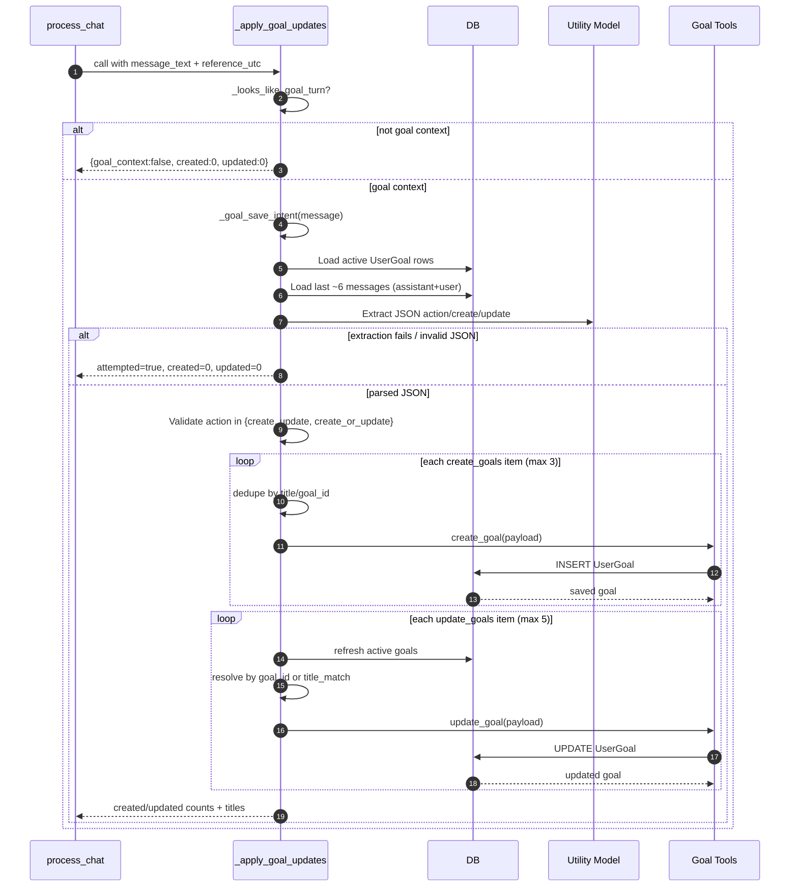
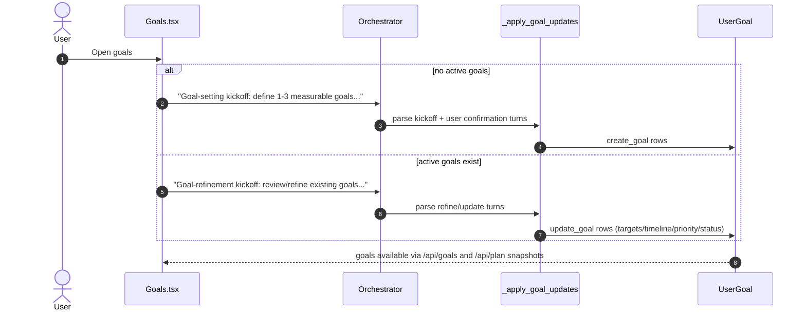
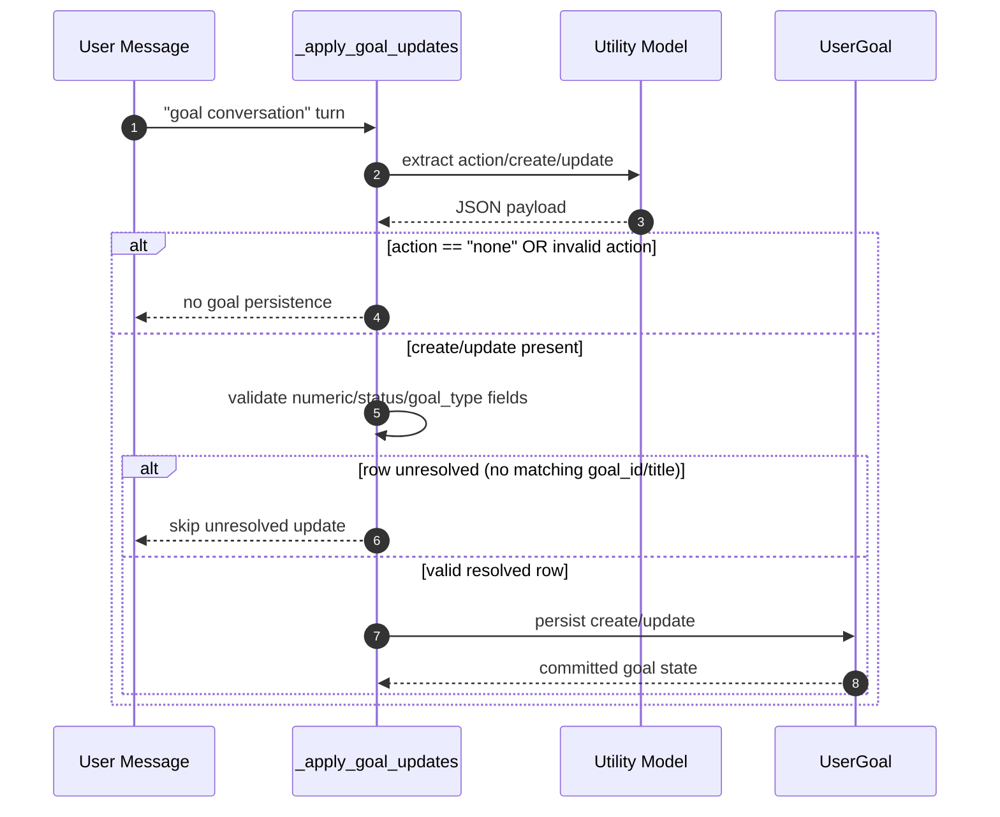

# Goal Input Parsing - Key Sequence Flows

This document captures the main runtime sequences for parsing user goal input and persisting structured goals.

## 1) Goals Page Kickoff -> Chat -> Goal Sync

## 2) Goal Extraction + Persistence (Detailed)

## 3) Create vs Refine Intents from Goals UI

## 4) Guardrails / Non-Persistence Paths

## Code Anchors

- Goal kickoff prompt composition: `frontend/src/pages/Goals.tsx`
- Goal extraction prompt and sync logic: `backend/ai/orchestrator.py`
- Goal persistence tool handlers: `backend/tools/goal_tools.py`
- CRUD API for goals page: `backend/api/goals.py`
